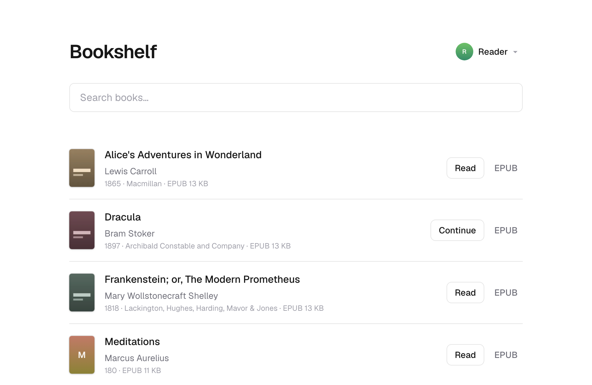

# Bookshelf

A self-hosted library for the ebooks you already own. Put your EPUBs and PDFs in
a folder, publish them, and read them in any browser — or on your Kobo, through
the [OPDS catalog](opds.md).



Run it as a Cloudflare Worker over R2, or as a Node server over a directory on
your own machine. Both use the same code and the same library.

## Try it in a minute

```bash
git clone https://github.com/murerkinn/bookshelf.git
cd bookshelf
npm install
npm run demo
```

That writes nine generated public-domain books into `books/` — eight EPUBs and a
PDF, so both readers are one click away. Nothing is downloaded. Publish and run
them by whichever route below, and you'll have the shelf in the screenshot.

The checked-in `bookshelf.config.json` points at Cloudflare R2, so `npm run
sync` goes there unless you change it. For a local look, switch it to the
filesystem provider first:

```jsonc
// bookshelf.config.json
{ "storage": { "provider": "fs", "directory": "shelf-data" } }
```

There's no hosted demo to visit. `npm run demo` is the substitute.

## Set up your own

You'll need Node 24 or newer and a Unix-like system. Covers come out better with
`cwebp` and `pdftoppm` installed — or use Docker, which ships both.

### With Docker

The shortest route.

```bash
mkdir books && cp ~/Downloads/*.epub books/
docker compose run --rm sync --create
docker compose up -d
```

Your shelf is on <http://localhost:3000>.

Back up the `library` volume. It holds your published books and everything the
app writes to them.

### On a machine you own

No account anywhere. Point the config at a directory, publish into it, and run
the app:

```jsonc
// bookshelf.config.json
{ "storage": { "provider": "fs", "directory": "shelf-data" } }
```

```bash
mkdir books && cp ~/Downloads/*.epub books/
npm run sync -- --create
npm run build
npm start -w @bookshelf/app
```

See [the filesystem provider](providers/fs.md) for running it on a VPS and for
keeping your library on an encrypted volume.

### On Cloudflare

You'll need a Cloudflare account.

```bash
npx wrangler login
npm run sync -- --create
npm run deploy
```

Two checked-in files carry the bucket and Worker name, and you need to edit both
— see [the R2 provider](providers/r2.md).

## What you get

**Both formats read in the browser.** EPUB and PDF each have a reader built for
them, and a book opens where you left it. Opening a 400-page PDF costs a few
tens of kilobytes rather than the whole file.
[Reading in the browser](reader.md).

**Publishing from a folder.** Drop books in, run the sync tool. Titles, authors
and covers come out of the files themselves — nothing is looked up online.
[Publishing a library](publishing.md).

**Separate reading positions.** Everyone sharing the shelf keeps their own place
in every book. [Profiles](profiles.md).

**An OPDS catalog.** KOReader, Thorium, Calibre and anything else that speaks
OPDS browses the same library your browser does. [The OPDS catalog](opds.md).

**Your files stay files.** There's no database. A library is a tree of books
plus one `catalog.json`, and all of it regenerates from the books you own — lose
your storage and you've lost an `npm run sync`, not a collection.
[The library format](library-format.md).

## Before you commit a library to it

**There is no authentication.** Anyone who can reach your shelf can download
every book in it. Put it on a network you trust, or behind something that asks
who's calling.

**Nothing is encrypted.** Your library is stored in the clear, and object keys
are slugified titles — a listing of your storage names your shelf.

**Two devices reading one profile at once is last-write-wins.**

[What's missing](roadmap.md) has the full list.

## Documentation

| | |
| --- | --- |
| [Publishing a library](publishing.md) | the sync tool, its flags, and covers |
| [The library format](library-format.md) | what ends up in storage, and what to back up |
| [Storage providers](providers/) | choosing where your library lives |
| [Cloudflare R2](providers/r2.md) | setup, deploying, publishing locally |
| [Filesystem](providers/fs.md) | your own machine or a VPS |
| [Profiles](profiles.md) | who is reading, and where they got to |
| [Reading in the browser](reader.md) | the readers and their controls |
| [The OPDS catalog](opds.md) | reading on a Kobo, a Kindle, or any OPDS client |
| [Architecture](architecture.md) | for working on the code |
| [What's missing](roadmap.md) | limitations, and what's planned |

The source is on [GitHub](https://github.com/murerkinn/bookshelf).
[CONTRIBUTING.md](https://github.com/murerkinn/bookshelf/blob/main/CONTRIBUTING.md)
covers working on it.

## License

MIT. The app and the Docker image also ship other people's code — pdf.js,
epub.js, React, and the two command-line tools that make covers — under their
own terms, listed in
[THIRD-PARTY-NOTICES.md](https://github.com/murerkinn/bookshelf/blob/main/THIRD-PARTY-NOTICES.md).

None of it says anything about the books you put in a library built with it,
whose copyright is between you and their publishers.
