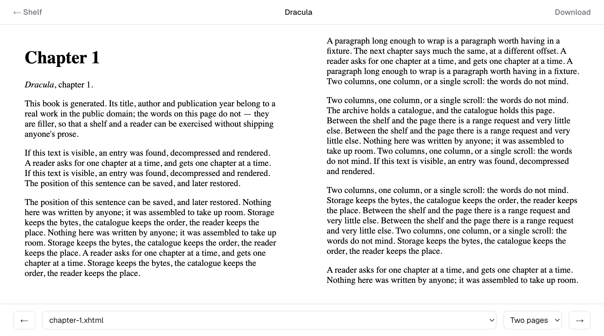

# Reading in the browser

Every book has a **Read** link, and each of the two formats has a reader of its
own behind it: [epub.js](#epub) for an EPUB, [pdf.js](#pdf) for a PDF. Anything
else — a format the sync tool has been taught to publish but the app has no
reader for — is still handed to the browser's own viewer in an iframe, served
with an inline disposition rather than as a download.

Both readers share the chrome around them, the way a position is kept, and
[ranged requests](#ranges) underneath. What they do not share is anything about
what a position *is*, or how a page reaches the screen.

## EPUB

EPUB has no native support, so it is rendered by epub.js — but pointed at the
book's package document rather than the `.epub` itself. That matters: given a
`.epub` URL, epub.js downloads the whole archive before showing page one, which
for this library would mean 8 MB typical and 42 MB worst case. Given the `.opf`,
it fetches chapters one at a time from `/book/<key>/<entry>`, which reads that
one file out of the archive in R2 using ranged requests.

Two things keep it quick. Each entry is fetched in **one** ranged read rather
than two — the local header sits in front of the data at an offset the central
directory doesn't record, so the read covers header and data together and parses
the header back out. And a book opens at its first real section rather than its
cover. Together those take a cold open from 1,755 KB to 73 KB. Continuous scroll
is the exception at around 1.3 MB, because it starts at the top of the book and
so does render that cover.

Book markup is untrusted, so the reader renders it in an iframe sandboxed
without `allow-scripts`, and entry responses carry a `sandbox` CSP for anyone
who opens one of those URLs directly.

## PDF

A PDF is one file rather than an archive, so the reader fetches it itself, in
[ranges](#ranges), and draws it with pdf.js. `disableAutoFetch` is what makes
that worth doing: left on, pdf.js pulls the rest of the file down in the
background as soon as it has the first pages, which for a scanned book is tens
of megabytes nobody asked for. With it off, a 40 MB book opens on a few
128 KB reads and the rest arrives as it is read.

One thing to expect in a network log: pdf.js opens with an ordinary request for
the whole file, reads `Accept-Ranges` and the length off the response headers,
and aborts it. That is how it discovers that ranges are available — there is no
option to tell it in advance — so the request shows as cancelled, having
transferred almost nothing.

A page is a box of the right shape whether or not it has been drawn. That is
what gives a five-hundred-page document a scrollbar that means something from
the moment it opens while only the pages near the reader cost anything: page one
is measured, stands in for every page not yet seen, and each page corrects its
own box as it is drawn. Canvases are given back when a page leaves the window,
because a page-sized bitmap is a few megabytes and five hundred of them is not a
thing to hold.

Drawing happens on a canvas off to the side and is copied in when it finishes.
Assigning a canvas's width clears it, so rendering straight onto the visible one
would blank the page for as long as the draw takes; this way a page part-way
through being redrawn at a new zoom goes soft rather than disappearing.

Over each page is pdf.js's text layer — absolutely positioned runs of
transparent text — which is what makes a page more than a picture of one: it can
be selected and copied, a screen reader has something to read, and the search
below has something to mark. Its rules live in `globals.css`, because pdf.js
builds that layer but does not style it.

**Layout** is the same choice of three the EPUB reader offers: two pages, one
page, or continuous scroll. A spread shows the first page alone and pairs
even-then-odd after it, which is how a bound book falls open. **Zoom** is
automatic by default — fitted to the width, but never past 125%, because filling
a wide monitor with a Letter page sets the body text at around twenty-four
points. Fit-width, fit-page and fixed percentages are all there as well.

**Keys** are on the scrolling region rather than on the window, so that paging
and the browser's own scrolling share one target — which is also why an arrow in
continuous scroll scrolls rather than turns, and why the region takes focus as
soon as a book is ready. Arrows, page-up and page-down, space and shift-space
turn in the page-at-a-time layouts; Home and End go to the ends of the book in
any of them. A swipe turns on a touchscreen.

**Page tint** is paper, sepia or night. A PDF's page is a picture, background and
all, so a reader cannot restyle it the way the EPUB reader restyles a chapter —
the only honest lever is a filter over the drawing. That is exact for the pages
of text and diagrams most of this kind of library is made of, and wrong for a
photograph, which is why paper is the default. The filter is on the canvas
rather than on the page, so the chrome around it keeps following the system
theme.

**Contents** comes from the document's outline, with every bookmark's page
resolved up front — so the panel can say where each entry goes and show which
section is being read. Bookmarks run to hundreds of entries in a technical book,
which is more than a dropdown can show and is why the PDF reader has a drawer
where the EPUB reader has a `<select>`.

**Search** is the one thing here with no server side at all. The text is already
coming to the browser to be drawn, so the same worker that renders a page is
asked what it says; the cost is one pass over the document the first time and
nothing after that. Results stream in as pages are scanned. Matching folds case
and drops accents — the same `NFKD` decomposition the sync tool uses to turn a
title into a directory name, so `Bronte` finds `Brontë` — and collapses runs of
whitespace, so a two-word query matches across a line break. Since the folded
copy is a different length from the original, folding records where each of its
characters came from; that is what lets an excerpt be cut out of the text as it
was actually written, at a word boundary, rather than shown stripped and
lower-cased.

Matches are marked with the browser's own highlight registry rather than by
wrapping the text in elements, because the runs are absolutely positioned and
splitting one moves the words inside it. Where that registry is missing, search
still finds and still jumps; only the marking is absent.

**pdf.js's own files** — its worker, the CMaps a CJK document names instead of
embedding, the fourteen standard fonts a PDF may assume, and the WebAssembly for
JPEG 2000 and JBIG2 images — are asked for by URL at the moment they are needed,
which no bundler can see. They are copied out of the package into `public/pdfjs`
by the app's `assets` task rather than committed, since they belong to
pdfjs-dist and change with it. Every one of them is conditional: a document with
no CJK text never fetches a CMap.

Not there yet: page thumbnails, tap zones for turning on a touchscreen, and
rotating a page that was scanned sideways.

## Ranges

`/download/<key>` advertises `Accept-Ranges: bytes` and answers a `Range` with a
`206` naming exactly what it served. That is what lets the PDF reader ask for the
part of a file it is showing, and it is the same saving the EPUB reader gets by
reading one entry out of an archive — except the client does the asking rather
than the server working it out.

It also makes a download resumable. An interrupted transfer continues from where
it stopped, guarded by `If-Range`: a client says which version it holds part of,
and if the book has been republished since — which happens at the same key — the
range is declined and the whole of the new file is sent, rather than two
different files being spliced together.

A single range is honoured. A request for several at once is answered with the
whole object, which is allowed, and avoids assembling a `multipart/byteranges`
body that nothing reading this library asks for.

Note that responses come back `Transfer-Encoding: chunked` without a
`Content-Length`: workerd streams a body of unstated length that way. The extent
of a partial response is in its `Content-Range` regardless, but a browser's
download UI has no total to show a percentage against.

## Keeping a place

A position is a CFI in an EPUB and a page number in a PDF, and everything around
that difference is the same for both — so it is written once, in
`read/[...key]/position.ts`, and both readers use it.

The browser's copy is written first and without waiting, so a place is never at
the mercy of the network; the library catches up once the reader pauses, four
seconds later, which collapses a chapter's worth of page turns into one write.
The last position of a session goes out with `sendBeacon`, because a normal
request does not survive the page being closed. On the way in, the library's copy
and the browser's are reconciled once, newest wins — which is right whichever
device was last used, and means a reader that was offline does not lose its place
to a stale server copy.

Which file it is written to depends on [which profile](profiles.md) is reading.
Against a library the app cannot write to, positions stay in the browser and the
reader is told not to try — the same degradation as a read-only instance.

Layout, zoom and tint are remembered per device rather than per profile: they are
properties of the screen being read on, not of the person reading.
